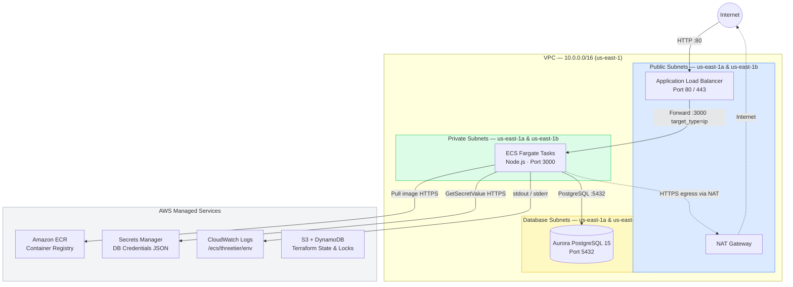

# AWS 3-Tier Terraform Infrastructure

Production-grade AWS infrastructure using Terraform — ECS Fargate + Aurora PostgreSQL + ALB, deployed across two Availability Zones with full network isolation, secrets management, and a CI/CD pipeline.

---

## Architecture



### Security Group Rules

| Security Group | Inbound | Outbound |
|---|---|---|
| **ALB** | :80, :443 from `0.0.0.0/0` | All traffic |
| **ECS** | :3000 from ALB SG only | :443 to internet (ECR/SM/CW), :5432 to RDS SG |
| **RDS** | :5432 from ECS SG only | — |

---

## Project Structure

```
aws-3tier-terraform/
├── main.tf               # Root — wires all modules together
├── variables.tf          # Input variables with defaults
├── outputs.tf            # ALB DNS, ECR URL, ECS names, secret ARN
├── provider.tf           # AWS + random providers, S3 backend
│
├── modules/
│   ├── vpc/              # VPC, subnets (public/private/db), NAT, route tables
│   ├── security_groups/  # ALB SG, ECS SG, RDS SG — tiered access
│   ├── ecr/              # Container registry + lifecycle policy (10 images)
│   ├── alb/              # Internet-facing ALB, target group, HTTP listener
│   ├── ecs/              # Fargate cluster, task definition, service, CloudWatch
│   ├── rds/              # Aurora PostgreSQL, random password, Secrets Manager
│   └── iam/              # Task execution role + task role (least-privilege)
│
├── app/
│   ├── server.js         # Express app — GET /, GET /health, GET /db
│   ├── package.json
│   └── Dockerfile        # node:20-alpine, non-root user, layer-cached deps
│
└── .github/
    └── workflows/
        └── terraform.yml # validate → plan (PR comment) → apply → ECR push → ECS deploy
```

---

## Prerequisites

| Tool | Version | Purpose |
|---|---|---|
| Terraform | >= 1.5 | Infrastructure provisioning |
| AWS CLI | v2 | Authentication, ECR login, ECS deploy |
| Docker | any | Build and push container images |
| Git | any | Clone and version control |

An AWS IAM user or role with permissions covering: VPC, ECS, ECR, RDS, ALB, IAM, Secrets Manager, CloudWatch, S3, DynamoDB.

---

## Environments

Environments are driven by **Terraform workspaces**. All resource names include the workspace name so `dev` and `prod` resources never collide.

| Workspace | Use |
|---|---|
| `dev` | Development / demo |
| `prod` | Production (deletion protection enabled on ALB + RDS) |

---

## Deployment

### 1 — Bootstrap the State Backend (once)

```bash
# Create a globally unique S3 bucket for Terraform state
BUCKET="threetier-tf-state-$(aws sts get-caller-identity --query Account --output text)"

aws s3api create-bucket --bucket "$BUCKET" --region us-east-1
aws s3api put-bucket-versioning --bucket "$BUCKET" \
  --versioning-configuration Status=Enabled
aws s3api put-bucket-encryption --bucket "$BUCKET" \
  --server-side-encryption-configuration \
  '{"Rules":[{"ApplyServerSideEncryptionByDefault":{"SSEAlgorithm":"AES256"}}]}'
aws s3api put-public-access-block --bucket "$BUCKET" \
  --public-access-block-configuration \
  "BlockPublicAcls=true,IgnorePublicAcls=true,BlockPublicPolicy=true,RestrictPublicBuckets=true"

# State locking table
aws dynamodb create-table \
  --table-name terraform-locks \
  --attribute-definitions AttributeName=LockID,AttributeType=S \
  --key-schema AttributeName=LockID,KeyType=HASH \
  --billing-mode PAY_PER_REQUEST \
  --region us-east-1
```

### 2 — Configure the Backend

Replace the placeholder in `provider.tf`:

```bash
sed -i "s/your-terraform-state-bucket/$BUCKET/" provider.tf
```

### 3 — Deploy Infrastructure

```bash
terraform init
terraform workspace new dev      # or: terraform workspace select dev
terraform validate
terraform plan
terraform apply
```

> Aurora takes 8–12 minutes to provision. Total apply time is ~20 minutes.

### 4 — Build and Push the Docker Image

```bash
ECR_URL=$(terraform output -raw ecr_repository_url)
REGION="us-east-1"
ACCOUNT=$(aws sts get-caller-identity --query Account --output text)

aws ecr get-login-password --region $REGION | \
  docker login --username AWS --password-stdin "$ACCOUNT.dkr.ecr.$REGION.amazonaws.com"

docker build -t threetier-app ./app
docker tag  threetier-app:latest "$ECR_URL:latest"
docker push "$ECR_URL:latest"
```

### 5 — Deploy the Container

```bash
aws ecs update-service \
  --cluster  "$(terraform output -raw ecs_cluster_name)" \
  --service  "$(terraform output -raw ecs_service_name)" \
  --force-new-deployment \
  --region   $REGION

aws ecs wait services-stable \
  --cluster  "$(terraform output -raw ecs_cluster_name)" \
  --services "$(terraform output -raw ecs_service_name)" \
  --region   $REGION
```

### 6 — Verify

```bash
ALB=$(terraform output -raw alb_dns_name)

curl http://$ALB/health   # {"status":"healthy"}
curl http://$ALB/         # {"message":"...","environment":"dev","database":"connected"}
curl http://$ALB/db       # {"database":"connected","time":"..."}
```

---

## CI/CD Pipeline

The GitHub Actions workflow in [.github/workflows/terraform.yml](.github/workflows/terraform.yml) runs automatically:

| Trigger | Jobs |
|---|---|
| Pull request to `main` | Format check → Init → Validate → Plan (posted as PR comment) |
| Push to `main` | Above + Apply → Docker build/push to ECR → ECS force-redeploy → wait for stability |

**Required GitHub secret**: `AWS_ROLE_ARN` — an IAM role configured for OIDC federation with GitHub Actions (no long-lived access keys).

---

## Key Design Decisions

| Decision | Reason |
|---|---|
| Fargate (no EC2) | No node management, patching, or cluster sizing |
| `target_type = ip` on target group | Required for Fargate awsvpc networking |
| `single_nat_gateway = true` | Cost savings for non-prod; set to `false` in prod for HA |
| `random_password` + Secrets Manager | No credentials in code or state file |
| Separate execution role and task role | Principle of least privilege — ECS control plane vs. application runtime |
| `lifecycle { ignore_changes = [task_definition] }` | CI/CD pipeline owns image updates; Terraform owns infrastructure |
| Workspace-prefixed S3 state key | `envs/dev/3tier/terraform.tfstate` — clean per-environment isolation |

---

## Tear Down

```bash
terraform destroy
```

> Deletes all AWS resources. Does **not** delete the S3 state bucket or DynamoDB table — remove those manually if no longer needed.

**Estimated cost while running**: ~$3–6 per day (NAT Gateway + Aurora + ALB dominate).
